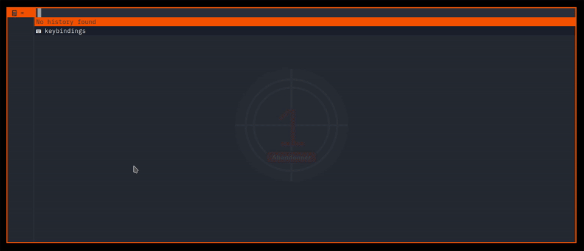

# bemenu-qalc

A simple [bemenu](https://github.com/Cloudef/bemenu) calculator using `qalc` (powerful and easy to use calculator, supporting complex math, conversions and more...),  inspired by [Nicolas RAYMOND's dmenu-calc](https://github.com/Helcoume/dmenu-calc).



The preview uses my wrapper for bemenu: [bemenu-orange-wrapper](https://github.com/tkapias/bemenu-orange-wrapper).

## Dependencies

- [qalc](https://github.com/Qalculate/libqalculate)
- [bemenu >= 0.6](https://github.com/Cloudef/bemenu)
- [Nerd Fonts (Symbols Only)](https://github.com/ryanoasis/nerd-fonts/releases/latest)
- Bash >= 5
- xclip

### Optional

- [bemenu-orange-wrapper](https://github.com/tkapias/bemenu-orange-wrapper)
- [qalculate-gtk: Qalculate!](https://github.com/Qalculate/qalculate-gtk)

## Installation

### Dependencies

- Debian example with [bemenu-orange-wrapper](https://github.com/tkapias/bemenu-orange-wrapper):

1. Follow [bemenu-orange-wrapper instructions](https://github.com/tkapias/bemenu-orange-wrapper?tab=readme-ov-file#installation).

2. Next:

``` bash
# xclip, qalc, qalculate-gtk
sudo apt install xclip qalc qalculate-gtk
```

### bemenu-qalc

```bash
git clone --depth 1 https://github.com/tkapias/bemenu-qalc.git bemenu-qalc
cd bemenu-qalc
chmod +x bemenu-qalc.bash
```

- Optional: Symlink to a directory in your user's path:

```bash
ln -s $PWD/bemenu-qalc.bash $HOME/.local/bin/bemenu-qalc
```

## Features

- History: persistant, resetable.
- Clipboard: copy the last result.
- Keybindings: bemenu Default + Vim-like, displayable.
- Previous result: auto reuse, clearable.
- Link to GUI: qalculate-gtk

## Usage

bemenu-qalc relies entirely on the dynamic actions provided inline, bemenu controls and qalc syntax.

The history is stored in `$HOME/.local/state/bemenu-qalc-history.txt`. It is persistant and resetable inline.

### Integrations

- Binding example for bemenu-qalc in i3wm:

```i3wm
bindsym $mod+c exec --no-startup-id "bemenu-qalc"
```

